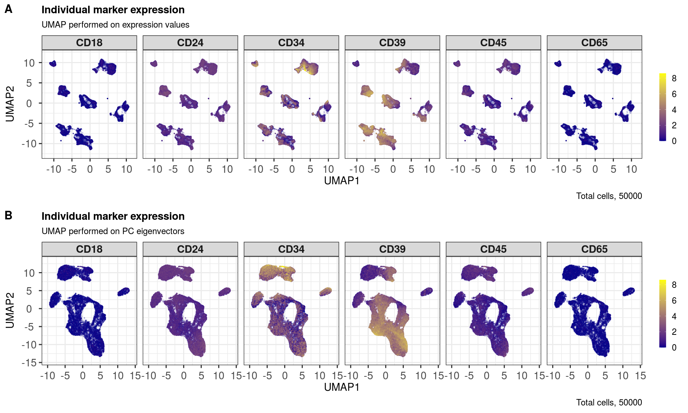
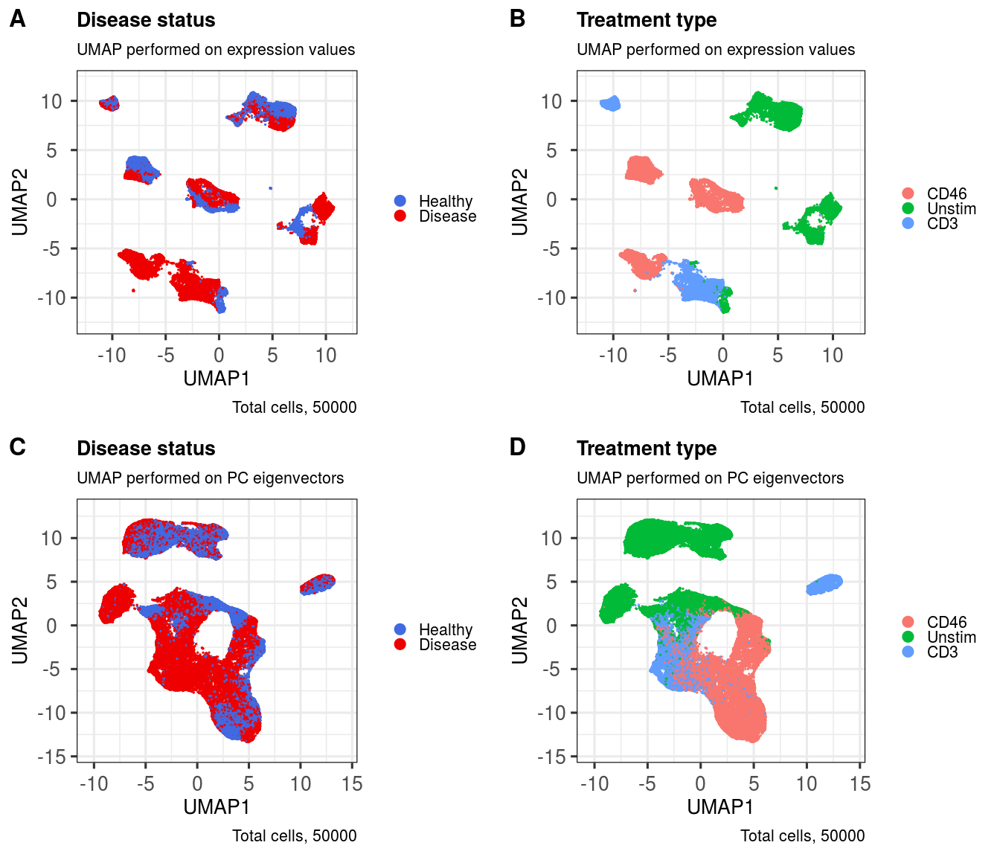
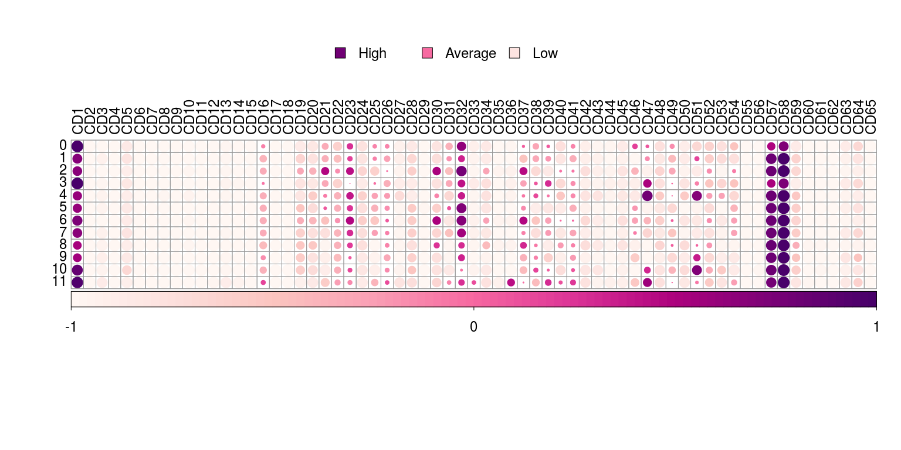

scToolkit: single cell dataviz and downstream analyses
================
Kevin Blighe, Jessica Timms, Steven Hargreaves, Shahram Kordasti
2020-02-06

Introduction
============

In the 'single cell' World, which includes flow cytometry, mass cytometry, single-cell RNA-seq (scRNA-seq), and others, there is a need to improve data visualisation of results and to bring analysis capabilities to researchers even from non-technical backgrounds who have some experience in coding. *scToolkit* (Blighe et al. 2020) attempts to fit into this space, while also catering for advanced users. Due to the way that it's designed, *scToolkit* also has a 'plug and play' feel, whereby the base storage unit, which is based on *SingleCellExperiment* (Lun et al. 2019), immediately lends flexibility and compatibility with studies that go beyond *scToolkit*. Additionally, the graphics are generated via the *ggplot* (Wickham 2016) engine, which means that users can 'add on' features to these to their pleasing.

...

Installation
============

1. Install from GitHub
----------------------

``` r
  devtools::install_github('kevinblighe/scToolkit')
```

2. Load the package into R session
----------------------------------

Quick start
===========

Here, we use sample data stored as FCS files.

``` r
  filelist <- list.files(
    path = "FCS/",
    pattern = "*.fcs|*.FCS",
    full.names = TRUE)
  filelist

  metadata <- data.frame(
    group = c(rep('Healthy', 7), rep('Disease', 11)),
    treatment = gsub('\\.fcs$', '', gsub('FCS\\/\\/[A-Z0-9]*\\ ', '', filelist)),
    row.names = filelist,
    stringsAsFactors = FALSE)
  metadata

  sce <- processFCS(
    files = filelist,
    metadata = metadata,
    transformation = TRUE,
    downsample = 0.85,
    newColnames = paste0('CD', 1:65))
```

One can also create a new object manually using any type of data, including any data-matrix from scRNA-seq produced elsewhere.

``` r
  # not run

  mat1 <- jitter(matrix(
    MASS::rnegbin(rexp(4000000, rate=.1), theta = 4.5),
    ncol = 20))
  colnames(mat1) <- paste0('CD', 1:ncol(mat1))
  mat2 <- jitter(matrix(
    MASS::rnegbin(rexp(4000000, rate=.1), theta = 2.5),
    ncol = 20))
  colnames(mat2) <- paste0('CD', 1:ncol(mat2))

  metadata <- data.frame(
    group = c('PB1', 'PB2'),
    row.names = c('mat1', 'mat2'),
    stringsAsFactors = FALSE)

  #...
```

Perform principal component analysis
------------------------------------

``` r
  p <- pca(assay(sce, 'scaled'), metadata = metadata(sce))
  biplot(p, lab = NULL, pointSize = 0.5, colby = 'treatment', legendPosition = 'right')
```


``` r
  reducedDim(sce, 'PCA') <- p$rotated[,1:20]
```

For more functionality via *PCAtools*, check the vignette: (PCAtools: everything Principal Component Analysis)\[<https://bioconductor.org/packages/release/bioc/vignettes/PCAtools/inst/doc/PCAtools.html>\]

Perform UMAP
------------

UMAP can be performed on the entire dataset, if your computer's memory will permit:

``` r
  sce <- performUMAP(sce)
```

UMAP can also be stratified based on a column in your metadata, e.g., (treated versus untreated samples); however, to do this, we simply recommend creating separate SingleCellExperiment objects from the very start, i.e., the data input stage, and processing the data separately for each group.

We can also perform UMAP on a select number of PC eigenvectors ('dimensions'). *PCAtools* can be used to infer ideal number of dimensions to use via the elbow method and Horn's parallel analysis.

``` r
  #elbow <- findElbowPoint(p$variance)
  elbow
```

    ## PC9 
    ##   9

``` r
  #horn <- parallelPCA(assay(sce, 'scaled'))
  horn$n
```

    ## [1] 4

``` r
  sce <- performUMAP(sce, reducedDim = 'PCA', dims = c(1:horn$n))

``
```

Create a contour plot of the UMAP layout
----------------------------------------

``` r
  ggout1 <- contourplot(sce, reducedDim = 'UMAP', subtitle = 'UMAP performed on expression values')
  ggout2 <- contourplot(sce, reducedDim = 'UMAP_PCA', subtitle = 'UMAP performed on PC eigenvectors')

  plot_grid(ggout1, ggout2,
    labels = c('A','B'),
    ncol = 2, align = "l", label_size = 24)
```


Show marker expression across the layout
----------------------------------------

...

``` r
  markers <- sample(rownames(sce), 6)
  markers
```

    ## [1] "CD2"  "CD18" "CD51" "CD56" "CD37" "CD59"

``` r
  ggout1 <- markerExpression(sce,
    markers = markers,
    subtitle = 'UMAP performed on expression values',
    nrow = 1, ncol = 6,
    legendKeyHeight = 1.0)

  ggout2 <-  markerExpression(sce,
    markers = markers,
    reducedDim = 'UMAP_PCA',
    subtitle = 'UMAP performed on PC eigenvectors',
    nrow = 1, ncol = 6,
    legendKeyHeight = 1.0)

  plot_grid(ggout1, ggout2,
    labels = c('A','B'),
    nrow = 2, align = "l", label_size = 24)
```



Shade cells by metadata
-----------------------

``` r
  head(metadata(sce))
```

    ##         group treatment
    ## cell1 Healthy      CD46
    ## cell2 Healthy      CD46
    ## cell3 Healthy      CD46
    ## cell4 Healthy      CD46
    ## cell5 Healthy      CD46
    ## cell6 Healthy      CD46

``` r
  levels(metadata(sce)$group)
```

    ## [1] "Healthy" "Disease"

``` r
  levels(metadata(sce)$treatment)
```

    ## [1] "CD46"   "Unstim" "CD3"

``` r
  ggout1 <- metadataplot(sce,
    colby = 'group',
    colkey = c(Healthy = 'royalblue', Disease = 'red2'),
    title = 'Disease status',
    subtitle = 'UMAP performed on expression values')

  ggout2 <- metadataplot(sce,
    reducedDim = 'UMAP_PCA',
    colby = 'group',
    colkey = c(Healthy = 'royalblue', Disease = 'red2'),
    title = 'Disease status',
    subtitle = 'UMAP performed on PC eigenvectors')

  ggout3 <- metadataplot(sce,
    colby = 'treatment',
    title = 'Treatment type',
    subtitle = 'UMAP performed on expression values')

  ggout4 <- metadataplot(sce,
    reducedDim = 'UMAP_PCA',
    colby = 'treatment',
    title = 'Treatment type',
    subtitle = 'UMAP performed on PC eigenvectors')

  plot_grid(ggout1, ggout3, ggout2, ggout4,
    labels = c('A','B','C','D'),
    nrow = 2, ncol = 2, align = "l", label_size = 24)
```



Find ideal clusters in the UMAP layout via k-nearest neighbuors
---------------------------------------------------------------

``` r
  sce <- clusKNN(sce,
    k.param = 20,
    prune.SNN = 1/15,
    resolution = 0.01,
    algorithm = 2)
```

    ## Modularity Optimizer version 1.3.0 by Ludo Waltman and Nees Jan van Eck
    ## 
    ## Number of nodes: 274417
    ## Number of edges: 6153275
    ## 
    ## Running Louvain algorithm with multilevel refinement...
    ## Maximum modularity in 10 random starts: 0.9990
    ## Number of communities: 20
    ## Elapsed time: 100 seconds

``` r
  sce <- clusKNN(sce,
    reducedDim = 'UMAP_PCA',
    clusterAssignName = 'Cluster_PCA',
    k.param = 20,
    prune.SNN = 1/15,
    resolution = 0.01,
    algorithm = 2)
```

    ## Modularity Optimizer version 1.3.0 by Ludo Waltman and Nees Jan van Eck
    ## 
    ## Number of nodes: 274417
    ## Number of edges: 6103285
    ## 
    ## Running Louvain algorithm with multilevel refinement...
    ## Maximum modularity in 10 random starts: 0.9973
    ## Number of communities: 8
    ## Elapsed time: 85 seconds

``` r
  ggout1 <- plotClusters(sce,
    clusterColname = 'Cluster',
    subtitle = 'UMAP performed on expression values',
    caption = paste0('Note: clusters / communities identified via',
      '\nLouvain algorithm with multilevel refinement'))

  ggout2 <- plotClusters(sce,
    clusterColname = 'Cluster_PCA',
    reducedDim = 'UMAP_PCA',
    subtitle = 'UMAP performed on PC eigenvectors',
    caption = paste0('Note: clusters / communities identified via',
      '\nLouvain algorithm with multilevel refinement'))

  plot_grid(ggout1, ggout2,
    labels = c('A','B'),
    ncol = 2, align = "l", label_size = 24)
```


plot marker expression per identified cluster
---------------------------------------------

``` r
  markerExpressionPerCluster(sce,
    caption = 'Cluster assignments based on UMAP performed on expression values')
```


``` r
  markerExpressionPerCluster(sce,
    clusters = unique(metadata(sce)[['Cluster_PCA']]),
    clusterVector = metadata(sce)[['Cluster_PCA']],
    markers = sample(rownames(sce), 15),
    axisLabSize = 14,
    nrow = 2, ncol = 4,
    caption = 'Cluster assignments based on UMAP performed on PC eigenvectors')
```


Differential expression comparison between clusters
---------------------------------------------------

``` r
  c1 <- rownames(subset(metadata(sce), group == 'Disease'))
  c2 <- rownames(subset(metadata(sce), group == 'Healthy'))

  #res <- diffExpression(sce,
  #  cells1 = c1,
  #  cells2 = c2)

  #res
```

Determine enriched markers in each cluster and plot the expression signature
----------------------------------------------------------------------------

|  Cluster|  nCells|  TotalCells|  PercentCells| NegMarkers           | PosMarkers |  PerCent\_Healthy|  PerCent\_Disease|  nCell\_Healthy|  nCell\_Disease|
|--------:|-------:|-----------:|-------------:|:---------------------|:-----------|-----------------:|-----------------:|---------------:|---------------:|
|        0|   33326|      274417|    12.1442914| NA                   | NA         |        37.3402148|        62.6597852|           12444|           20882|
|        1|   32639|      274417|    11.8939424| CD46-                | CD47+CD51+ |         0.1470633|        99.8529367|              48|           32591|
|        2|   32184|      274417|    11.7281364| CD30-                | CD47+      |         0.1553567|        99.8446433|              50|           32134|
|        3|   31552|      274417|    11.4978299| CD46-                | CD47+      |        77.3389959|        22.6610041|           24402|            7150|
|        4|   28315|      274417|    10.3182383| CD19-CD28-CD31-CD46- | CD47+CD51+ |        57.6867385|        42.3132615|           16334|           11981|
|        5|   20691|      274417|     7.5399848| CD47-                | CD21+CD30+ |        74.3801653|        25.6198347|           15390|            5301|
|        6|   18010|      274417|     6.5630045| CD51-                | CD30+      |         0.7662410|        99.2337590|             138|           17872|
|        7|   16996|      274417|     6.1934938| CD51-                | CD46+CD54+ |        66.5038833|        33.4961167|           11303|            5693|
|        8|   15219|      274417|     5.5459392| CD51-                | CD46+      |        58.8343518|        41.1656482|            8954|            6265|
|        9|   14725|      274417|     5.3659212| CD47-                | CD30+      |         0.3667233|        99.6332767|              54|           14671|
|       10|   10724|      274417|     3.9079212| CD47-CD51-           | CD31+      |        99.4684819|         0.5315181|           10667|              57|
|       11|    9655|      274417|     3.5183680| CD47-                | CD46+      |        56.8513723|        43.1486277|            5489|            4166|
|       12|    7838|      274417|     2.8562370| CD47-                | CD30+      |         1.3906609|        98.6093391|             109|            7729|
|       13|    1098|      274417|     0.4001210| CD46-                | CD51+      |        99.6357013|         0.3642987|            1094|               4|
|       14|     618|      274417|     0.2252047| CD25-CD31-CD46-      | CD51+      |        99.6763754|         0.3236246|             616|               2|
|       15|     556|      274417|     0.2026114| CD46-                | CD31+      |        99.2805755|         0.7194245|             552|               4|
|       16|     118|      274417|     0.0430003| CD47-                | CD51+      |         7.6271186|        92.3728814|               9|             109|
|       17|     115|      274417|     0.0419070| CD23-                | CD33+CD36+ |         0.0000000|       100.0000000|               0|             115|
|       18|      22|      274417|     0.0080170| CD23-CD46-           | CD33+      |        95.4545455|         4.5454545|              21|               1|
|       19|      16|      274417|     0.0058305| CD32-CD46-           | CD21+CD51+ |        50.0000000|        50.0000000|               8|               8|

|  Cluster|  nCells|  TotalCells|  PercentCells| NegMarkers           | PosMarkers |  PerCent\_CD46|  PerCent\_Unstim|  PerCent\_CD3|  nCell\_CD46|  nCell\_Unstim|  nCell\_CD3|
|--------:|-------:|-----------:|-------------:|:---------------------|:-----------|--------------:|----------------:|-------------:|------------:|--------------:|-----------:|
|        0|   33326|      274417|    12.1442914| NA                   | NA         |     99.8949769|        0.1020224|     0.0030007|        33291|             34|           1|
|        1|   32639|      274417|    11.8939424| CD46-                | CD47+CD51+ |      0.4442538|        0.1409357|    99.4148105|          145|             46|       32448|
|        2|   32184|      274417|    11.7281364| CD30-                | CD47+      |     99.4686801|        0.0000000|     0.5313199|        32013|              0|         171|
|        3|   31552|      274417|    11.4978299| CD46-                | CD47+      |     99.9302738|        0.0665568|     0.0031694|        31530|             21|           1|
|        4|   28315|      274417|    10.3182383| CD19-CD28-CD31-CD46- | CD47+CD51+ |      0.0000000|       99.9929366|     0.0070634|            0|          28313|           2|
|        5|   20691|      274417|     7.5399848| CD47-                | CD21+CD30+ |      0.0241651|       99.9661689|     0.0096660|            5|          20684|           2|
|        6|   18010|      274417|     6.5630045| CD51-                | CD30+      |      0.3275958|       99.5891172|     0.0832871|           59|          17936|          15|
|        7|   16996|      274417|     6.1934938| CD51-                | CD46+CD54+ |      0.0823723|       66.5038833|    33.4137444|           14|          11303|        5679|
|        8|   15219|      274417|     5.5459392| CD51-                | CD46+      |      0.0328537|       99.7240292|     0.2431172|            5|          15177|          37|
|        9|   14725|      274417|     5.3659212| CD47-                | CD30+      |      0.2105263|       99.7894737|     0.0000000|           31|          14694|           0|
|       10|   10724|      274417|     3.9079212| CD47-CD51-           | CD31+      |      0.1398732|       99.8321522|     0.0279746|           15|          10706|           3|
|       11|    9655|      274417|     3.5183680| CD47-                | CD46+      |      0.0000000|        0.0828586|    99.9171414|            0|              8|        9647|
|       12|    7838|      274417|     2.8562370| CD47-                | CD30+      |     99.8341414|        0.1403419|     0.0255167|         7825|             11|           2|
|       13|    1098|      274417|     0.4001210| CD46-                | CD51+      |     99.9089253|        0.0910747|     0.0000000|         1097|              1|           0|
|       14|     618|      274417|     0.2252047| CD25-CD31-CD46-      | CD51+      |     99.6763754|        0.3236246|     0.0000000|          616|              2|           0|
|       15|     556|      274417|     0.2026114| CD46-                | CD31+      |      1.0791367|       98.9208633|     0.0000000|            6|            550|           0|
|       16|     118|      274417|     0.0430003| CD47-                | CD51+      |      1.6949153|        9.3220339|    88.9830508|            2|             11|         105|
|       17|     115|      274417|     0.0419070| CD23-                | CD33+CD36+ |    100.0000000|        0.0000000|     0.0000000|          115|              0|           0|
|       18|      22|      274417|     0.0080170| CD23-CD46-           | CD33+      |     95.4545455|        4.5454545|     0.0000000|           21|              1|           0|
|       19|      16|      274417|     0.0058305| CD32-CD46-           | CD21+CD51+ |     56.2500000|       43.7500000|     0.0000000|            9|              7|           0|

``` r
  plotSignatures(sce)
```



Advanced features
=================

...

Acknowledgments
===============

Session info
============

``` r
sessionInfo()
```

    ## R version 3.6.2 (2019-12-12)
    ## Platform: x86_64-pc-linux-gnu (64-bit)
    ## Running under: Ubuntu 16.04.6 LTS
    ## 
    ## Matrix products: default
    ## BLAS:   /usr/lib/atlas-base/atlas/libblas.so.3.0
    ## LAPACK: /usr/lib/atlas-base/atlas/liblapack.so.3.0
    ## 
    ## locale:
    ##  [1] LC_CTYPE=pt_BR.UTF-8       LC_NUMERIC=C              
    ##  [3] LC_TIME=en_GB.UTF-8        LC_COLLATE=pt_BR.UTF-8    
    ##  [5] LC_MONETARY=en_GB.UTF-8    LC_MESSAGES=pt_BR.UTF-8   
    ##  [7] LC_PAPER=en_GB.UTF-8       LC_NAME=C                 
    ##  [9] LC_ADDRESS=C               LC_TELEPHONE=C            
    ## [11] LC_MEASUREMENT=en_GB.UTF-8 LC_IDENTIFICATION=C       
    ## 
    ## attached base packages:
    ## [1] parallel  stats4    stats     graphics  grDevices utils     datasets 
    ## [8] methods   base     
    ## 
    ## other attached packages:
    ##  [1] R.utils_2.9.0               R.oo_1.23.0                
    ##  [3] R.methodsS3_1.7.1           corrplot_0.84              
    ##  [5] RColorBrewer_1.1-2          Seurat_3.1.1               
    ##  [7] scales_1.0.0                umap_0.2.3.1               
    ##  [9] PCAtools_1.2.0              cowplot_1.0.0              
    ## [11] lattice_0.20-38             reshape2_1.4.3             
    ## [13] ggrepel_0.8.1               ggplot2_3.2.1              
    ## [15] SingleCellExperiment_1.8.0  SummarizedExperiment_1.16.0
    ## [17] DelayedArray_0.12.0         BiocParallel_1.20.0        
    ## [19] matrixStats_0.55.0          Biobase_2.46.0             
    ## [21] GenomicRanges_1.38.0        GenomeInfoDb_1.22.0        
    ## [23] IRanges_2.20.0              S4Vectors_0.24.0           
    ## [25] BiocGenerics_0.32.0         flowCore_1.52.0            
    ## [27] knitr_1.26                 
    ## 
    ## loaded via a namespace (and not attached):
    ##  [1] Rtsne_0.15               colorspace_1.4-1         ggridges_0.5.1          
    ##  [4] XVector_0.26.0           leiden_0.3.1             listenv_0.7.0           
    ##  [7] npsurv_0.4-0             codetools_0.2-16         splines_3.6.2           
    ## [10] lsei_1.2-0               zeallot_0.1.0            jsonlite_1.6            
    ## [13] ica_1.0-2                cluster_2.1.0            png_0.1-7               
    ## [16] uwot_0.1.4               sctransform_0.2.0        compiler_3.6.2          
    ## [19] httr_1.4.1               dqrng_0.2.1              backports_1.1.5         
    ## [22] assertthat_0.2.1         Matrix_1.2-17            lazyeval_0.2.2          
    ## [25] BiocSingular_1.2.0       htmltools_0.4.0          tools_3.6.2             
    ## [28] rsvd_1.0.2               igraph_1.2.4.1           gtable_0.3.0            
    ## [31] glue_1.3.1               GenomeInfoDbData_1.2.2   RANN_2.6.1              
    ## [34] dplyr_0.8.3              Rcpp_1.0.3               vctrs_0.2.0             
    ## [37] gdata_2.18.0             ape_5.3                  nlme_3.1-142            
    ## [40] DelayedMatrixStats_1.8.0 gbRd_0.4-11              lmtest_0.9-37           
    ## [43] xfun_0.11                stringr_1.4.0            globals_0.12.4          
    ## [46] lifecycle_0.1.0          irlba_2.3.3              gtools_3.8.1            
    ## [49] future_1.15.0            zlibbioc_1.32.0          MASS_7.3-51.4           
    ## [52] zoo_1.8-6                yaml_2.2.0               gridExtra_2.3           
    ## [55] reticulate_1.13          pbapply_1.4-2            stringi_1.4.3           
    ## [58] highr_0.8                caTools_1.17.1.2         bibtex_0.4.2            
    ## [61] Rdpack_0.11-0            SDMTools_1.1-221.1       rlang_0.4.1             
    ## [64] pkgconfig_2.0.3          bitops_1.0-6             evaluate_0.14           
    ## [67] ROCR_1.0-7               purrr_0.3.3              labeling_0.3            
    ## [70] htmlwidgets_1.5.1        tidyselect_0.2.5         RcppAnnoy_0.0.14        
    ## [73] plyr_1.8.4               magrittr_1.5             R6_2.4.1                
    ## [76] gplots_3.0.1.1           pillar_1.4.2             withr_2.1.2             
    ## [79] fitdistrplus_1.0-14      survival_3.1-7           RCurl_1.95-4.12         
    ## [82] tsne_0.1-3               tibble_2.1.3             future.apply_1.3.0      
    ## [85] crayon_1.3.4             KernSmooth_2.23-16       plotly_4.9.1            
    ## [88] rmarkdown_1.17           grid_3.6.2               data.table_1.12.6       
    ## [91] metap_1.1                digest_0.6.22            tidyr_1.0.0             
    ## [94] RcppParallel_4.4.4       openssl_1.4.1            munsell_0.5.0           
    ## [97] viridisLite_0.3.0        askpass_1.1

References
==========

Blighe et al. (2020)

Lun et al. (2019)

Wickham (2016)

Blighe, K, J Timms, S Hargreaves, and S Kordasti. 2020. “scToolkit: single cell dataviz and downstream analyses.” <https://github.com/kevinblighe>.

Lun, A, D Risso, K Korthauer, and K Rue-Albrecht. 2019. “SingleCellExperiment: S4 Classes for Single Cell Data.” R package version 1.8.0, https://bioconductor.org/packages/SingleCellExperiment/.

Wickham, H. 2016. “ggplot2: Elegant Graphics for Data Analysis.” Springer-Verlag New York, ISBN: 978-3-319-24277-4.

