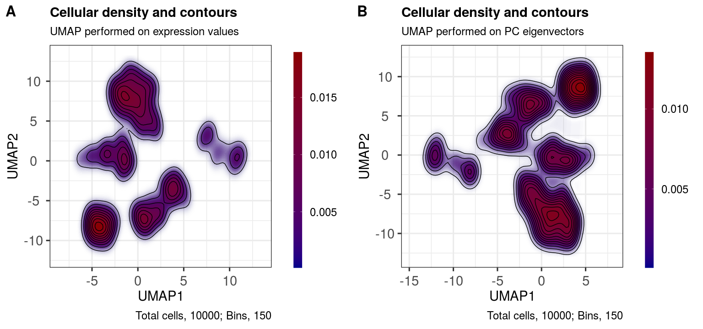
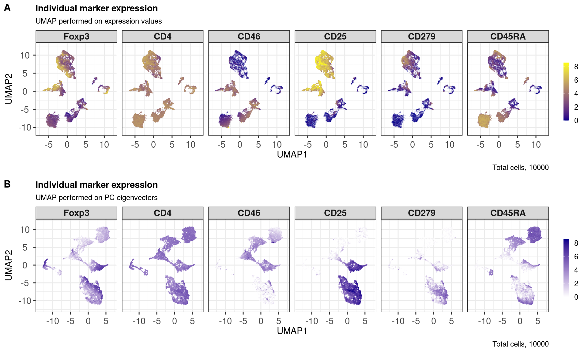
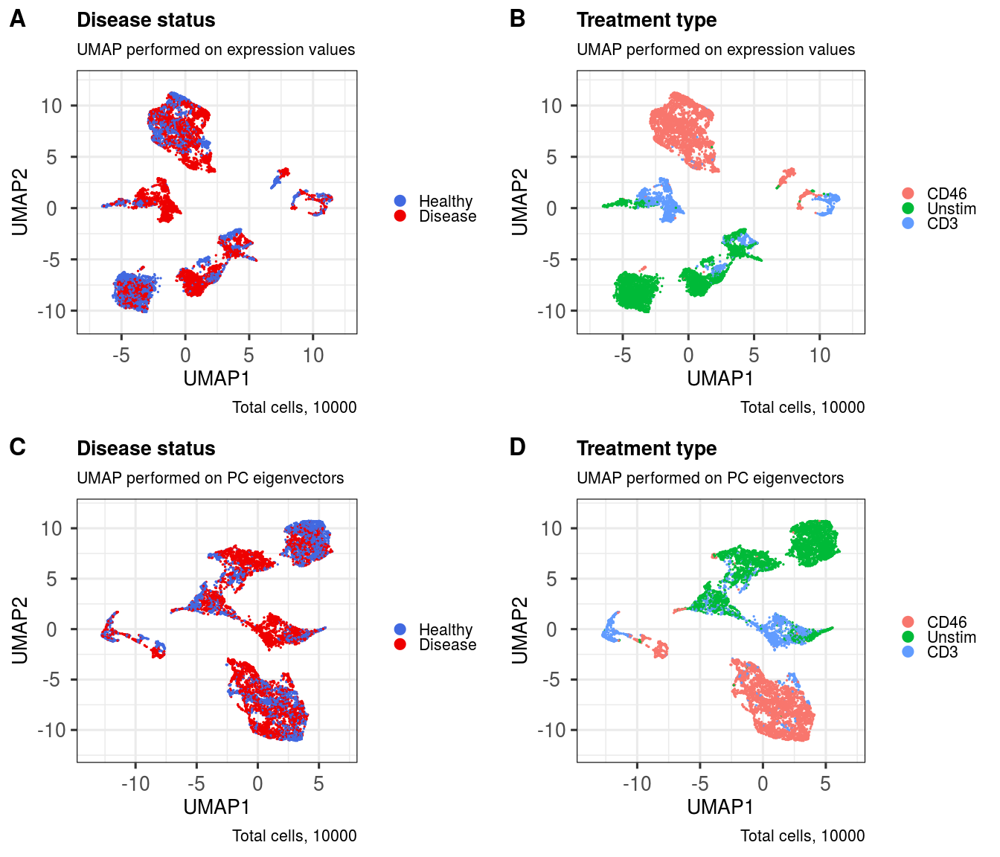
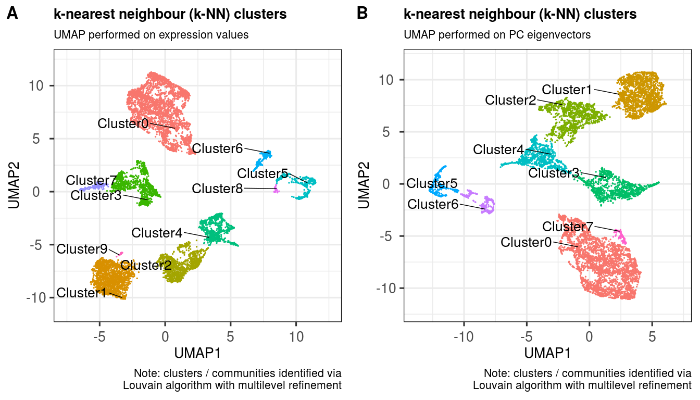

scToolkit: single cell downstream analyses
================
Kevin Blighe, Steven Hargreaves, Jessica Timms
2019-10-03

# Introduction

…

# Installation

## 1\. Download the package from Bioconductor

``` r
  if (!requireNamespace('BiocManager', quietly = TRUE))
    install.packages('BiocManager')
    BiocManager::install('scToolkit')
```

Note: to install development version:

``` r
  devtools::install_github('kevinblighe/scToolkit')
```

## 2\. Load the package into R session

``` r
  #library(scToolkit)

  library(R.utils)
  sourceDirectory('R')
```

# Quick start

…

``` r
  filelist <- list.files(
    path = "FCS/",
    pattern = "*.fcs|*.FCS",
    full.names = TRUE)

  metadata <- data.frame(
    file = filelist,
    group = c('PB1', 'HD', 'PB2'),
    row.names = filelist,
    stringsAsFactors = FALSE)

  require(flowCore)
  sct <- processFCS(
    files = filelist,
    metadata = metadata,
    transformation = FALSE,
    downsample = 5)
```

## FACS-like plots for pairwise marker comparison

…

``` r
 require(RColorBrewer)
 require(hexbin)
 require(lattice)

 facsplot(
   data = sct,
   marker1 = 'Ho165Di',
   marker2 = 'Nd144Di',
   log2 = TRUE,
   bins = 200)
```


## Perform principal components analysis

…

``` r
  require(PCAtools)
  p <- pca(t(sct$expression), metadata = sct$metadata)

  biplot(p, lab = FALSE, pointSize = 0.5)
```



## Perform UMAP

…

``` r
  require(umap)
  sct <- performUMAP(sct)
```

# Advanced features

…

## Create a contour plot of the UMAP layout

…

``` r
  ggout <- contourplot(sct)

  require(cowplot)
  plot_grid(ggout, ggout,
    labels = c("Unstimulated", "Stimulated"),
    ncol = 2, align = "h", label_size = 24)
```



## Show marker expression across the layout

…

``` r
  par(mfrow = c(2,4))
  markerExpression(
    data = sct,
    markers = sample(colnames(sct$expression), 8))
```



``` r
  par(mfrow = c(1,2))
  markerExpression(
    data = sct,
    markers = sample(colnames(sct$expression), 2))
```



## Find ideal clusters in the UMAP layout via k-nearest neighbuors

…

``` r
  sct <- clusKNN(
    sct,
    k.param = 15,
    resolution = 0.001,
    algorithm = 2)
```

    ## Modularity Optimizer version 1.3.0 by Ludo Waltman and Nees Jan van Eck
    ## 
    ## Number of nodes: 91849
    ## Number of edges: 1617410
    ## 
    ## Running Louvain algorithm with multilevel refinement...
    ## Maximum modularity in 10 random starts: 0.9999
    ## Number of communities: 18
    ## Elapsed time: 4 seconds

``` r
  # HD, unstim
  plot(
    sct$layout,
    main = "",
    xlab = "UMAP 1",
    ylab = "UMAP 2",
    xlim = c(min(sct$layout[,1], na.rm = TRUE) - 1, max(sct$layout[,1], na.rm = TRUE) + 1),
    ylim = c(min(sct$layout[,2], na.rm = TRUE) - 1, max(sct$layout[,2], na.rm = TRUE) + 1),
    col = sct$colour,
    pch = ".")
  text(sct$layout, labels = sct$lab, cex = 2.0, col = "black")
```


## plot marker expression per identified cluster

``` r
  require(reshape2)
  require(ggplot2)
  markerExpressionPerCluster(
    data = sct,
    ncol = 3,
    cluster = c(1,2,5,9,11,12))
```

<!-- -->

## Differential expression comparison between clusters

``` r
  res <- diffExpression(
    data = sct,
    cluster1 = 5,
    cluster2 = 8)

  res
```

    ##                 p_val    avg_logFC pct.1 pct.2     p_val_adj
    ## Er168Di  0.000000e+00  4.480161276 0.980 0.697  0.000000e+00
    ## Dy163Di  0.000000e+00  2.462581385 0.922 0.208  0.000000e+00
    ## Dy164Di  0.000000e+00  2.387271868 0.472 0.126  0.000000e+00
    ## Er166Di  0.000000e+00  0.363151621 0.720 0.364  0.000000e+00
    ## Sm154Di  0.000000e+00 -0.193928482 1.000 1.000  0.000000e+00
    ## Lu175Di  0.000000e+00 -0.287737320 0.084 0.535  0.000000e+00
    ## Nd144Di  0.000000e+00 -1.134803483 0.898 0.999  0.000000e+00
    ## Yb174Di  0.000000e+00 -4.454099869 0.578 1.000  0.000000e+00
    ## Tm169Di 1.492428e-273  0.742811796 0.458 0.175 7.760626e-272
    ## Ho165Di 6.832628e-258  1.480369302 0.536 0.319 3.552967e-256
    ## Ir191Di 1.834115e-228  0.305834620 1.000 1.000 9.537398e-227
    ## Ir193Di 1.074223e-227  0.302293192 1.000 1.000 5.585962e-226
    ## Dy162Di 2.379075e-221  0.194338594 0.351 0.128 1.237119e-219
    ## Y89Di   7.302327e-212  0.363886687 1.000 1.000 3.797210e-210
    ## Dy161Di 2.396390e-198  1.632822907 0.661 0.581 1.246123e-196
    ## Gd155Di 7.549102e-182  0.567919342 0.945 0.986 3.925533e-180
    ## Er170Di 4.418957e-179  0.280505438 0.702 0.512 2.297858e-177
    ## Gd160Di 4.594877e-166 -0.138848783 0.965 1.000 2.389336e-164
    ## Pt194Di 4.294986e-157  0.416269284 0.992 0.983 2.233393e-155
    ## Yb176Di 1.131825e-112  1.307990682 0.218 0.440 5.885492e-111
    ## Yb173Di  2.848833e-87  0.073847472 0.231 0.391  1.481393e-85
    ## Er167Di  1.519072e-70 -0.181710334 0.945 1.000  7.899174e-69
    ## Pt195Di  1.204383e-66  0.277714017 0.546 0.436  6.262792e-65
    ## Ba138Di  1.532026e-59  0.166495016 0.960 0.937  7.966533e-58
    ## I127Di   1.439373e-53  0.313460570 0.520 0.436  7.484739e-52
    ## Yb171Di  1.193841e-47  0.082169965 0.280 0.182  6.207975e-46
    ## Yb172Di  2.089074e-46 -0.028543448 0.051 0.112  1.086319e-44
    ## Nd143Di  5.996639e-46 -0.134952701 0.926 0.982  3.118252e-44
    ## Pb208Di  8.478722e-30  0.065475333 0.908 0.888  4.408935e-28
    ## Pt198Di  1.224058e-27  0.062983328 0.187 0.124  6.365100e-26
    ## Gd158Di  1.027733e-24 -0.078159081 0.988 1.000  5.344213e-23
    ## Sm147Di  8.803254e-23  0.464305261 0.413 0.357  4.577692e-21
    ## Ce140Di  2.879949e-21  0.048474364 0.406 0.335  1.497574e-19
    ## Nd150Di  1.363353e-20  0.190522835 0.249 0.320  7.089436e-19
    ## Nd146Di  3.961918e-20 -0.033191937 0.167 0.224  2.060197e-18
    ## Sm152Di  5.856424e-20  1.085085067 0.587 0.690  3.045340e-18
    ## Nd145Di  7.357499e-13 -0.037292554 0.380 0.436  3.825900e-11
    ## Tb159Di  2.070251e-11 -0.017609730 0.414 0.467  1.076530e-09
    ## Nd148Di  4.126486e-07  0.386787124 0.242 0.218  2.145773e-05
    ## Pr141Di  3.635891e-03  0.489549750 0.263 0.263  1.890663e-01
    ## Gd157Di  9.312127e-02 -0.003526958 0.678 0.704  1.000000e+00
    ## Xe131Di  1.039345e-01  0.011615163 0.175 0.165  1.000000e+00
    ## Gd156Di  1.830204e-01  0.011771058 0.452 0.467  1.000000e+00
    ## Nd142Di  4.331843e-01  0.004610630 0.172 0.177  1.000000e+00
    ## Eu153Di  6.098190e-01  0.027342005 0.155 0.160  1.000000e+00
    ## Sm149Di  9.739424e-01  0.594214099 0.273 0.286  1.000000e+00

## Determine enriched markers in each cluster and plot the expression signature

``` r
  markerEnrichment(sct)
```

    ##    Cluster nCells TotalCells PercentCells
    ## 1        0  14667      91849  15.96860064
    ## 2        1  12244      91849  13.33057518
    ## 3        2  10584      91849  11.52326100
    ## 4        3  10098      91849  10.99413167
    ## 5        4   9977      91849  10.86239371
    ## 6        5   9870      91849  10.74589816
    ## 7        6   7278      91849   7.92387506
    ## 8        7   6372      91849   6.93747346
    ## 9        8   5781      91849   6.29402606
    ## 10       9   3460      91849   3.76705244
    ## 11      10    446      91849   0.48557959
    ## 12      11    424      91849   0.46162724
    ## 13      12    345      91849   0.37561650
    ## 14      13    151      91849   0.16440027
    ## 15      14     46      91849   0.05008220
    ## 16      15     45      91849   0.04899346
    ## 17      16     37      91849   0.04028351
    ## 18      17     24      91849   0.02612984
    ## 19      18      0      91849   0.00000000
    ##                                  NegMarkers
    ## 1                                         -
    ## 2                                  Gd158Di-
    ## 3  Sm147Di-Eu151Di-Eu153Di-Yb173Di-Lu175Di-
    ## 4                          Eu151Di-Lu175Di-
    ## 5                          Eu151Di-Eu153Di-
    ## 6                          Sm154Di-Gd158Di-
    ## 7                          Ho165Di-Yb174Di-
    ## 8                                  Eu153Di-
    ## 9                                  Ho165Di-
    ## 10                                 Ho165Di-
    ## 11                                 Ir193Di-
    ## 12                         Sm154Di-Yb174Di-
    ## 13                                 Yb173Di-
    ## 14                 Eu151Di-Eu153Di-Lu175Di-
    ## 15                 Eu153Di-Ho165Di-Lu175Di-
    ## 16                         Gd155Di-Gd158Di-
    ## 17                                 Ho165Di-
    ## 18         Sm147Di-Eu151Di-Eu153Di-Lu175Di-
    ## 19                                 Sm154Di-
    ##                          PosMarkers
    ## 1                                 +
    ## 2                   I127Di+Sm147Di+
    ## 3                          Yb174Di+
    ## 4                          Yb174Di+
    ## 5                   I127Di+Sm147Di+
    ## 6                          Sm147Di+
    ## 7                          Er168Di+
    ## 8                          Er168Di+
    ## 9                          Yb171Di+
    ## 10                 Gd158Di+Yb174Di+
    ## 11 Ce140Di+Eu151Di+Eu153Di+Lu175Di+
    ## 12 Ce140Di+Eu151Di+Eu153Di+Lu175Di+
    ## 13 Ce140Di+Eu151Di+Eu153Di+Lu175Di+
    ## 14                         Pt195Di+
    ## 15                         Gd156Di+
    ## 16                         Yb173Di+
    ## 17                 Nd144Di+Gd158Di+
    ## 18                         Nd150Di+
    ## 19 Ce140Di+Eu151Di+Eu153Di+Lu175Di+

``` r
  require(corrplot)
  plotSignatures(sct)
```

<!-- -->

# Acknowledgments

The development of *scToolkit* has benefited from contributions and
suggestions from:

# Session info

``` r
sessionInfo()
```

    ## R version 3.6.0 (2019-04-26)
    ## Platform: x86_64-w64-mingw32/x64 (64-bit)
    ## Running under: Windows 10 x64 (build 17763)
    ## 
    ## Matrix products: default
    ## 
    ## locale:
    ## [1] LC_COLLATE=English_United Kingdom.1252 
    ## [2] LC_CTYPE=English_United Kingdom.1252   
    ## [3] LC_MONETARY=English_United Kingdom.1252
    ## [4] LC_NUMERIC=C                           
    ## [5] LC_TIME=English_United Kingdom.1252    
    ## 
    ## attached base packages:
    ## [1] stats     graphics  grDevices utils     datasets  methods   base     
    ## 
    ## other attached packages:
    ##  [1] corrplot_0.84      Seurat_3.0.2       SDMTools_1.1-221.1
    ##  [4] umap_0.2.2.0       PCAtools_1.0.0     cowplot_1.0.0     
    ##  [7] reshape2_1.4.3     ggrepel_0.8.1      ggplot2_3.2.0     
    ## [10] lattice_0.20-38    hexbin_1.27.3      RColorBrewer_1.1-2
    ## [13] flowCore_1.50.0    R.utils_2.9.0      R.oo_1.22.0       
    ## [16] R.methodsS3_1.7.1  knitr_1.23        
    ## 
    ## loaded via a namespace (and not attached):
    ##  [1] tsne_0.1-3          nlme_3.1-141        bitops_1.0-6       
    ##  [4] matrixStats_0.54.0  httr_1.4.0          sctransform_0.2.0  
    ##  [7] backports_1.1.4     tools_3.6.0         R6_2.4.0           
    ## [10] irlba_2.3.3         KernSmooth_2.23-15  lazyeval_0.2.2     
    ## [13] BiocGenerics_0.30.0 colorspace_1.4-1    npsurv_0.4-0       
    ## [16] withr_2.1.2         gridExtra_2.3       tidyselect_0.2.5   
    ## [19] compiler_3.6.0      graph_1.62.0        Biobase_2.44.0     
    ## [22] plotly_4.9.0        labeling_0.3        caTools_1.17.1.2   
    ## [25] scales_1.0.0        DEoptimR_1.0-8      lmtest_0.9-37      
    ## [28] mvtnorm_1.0-11      robustbase_0.93-5   pbapply_1.4-1      
    ## [31] ggridges_0.5.1      stringr_1.4.0       digest_0.6.20      
    ## [34] rmarkdown_1.16      rrcov_1.4-7         pkgconfig_2.0.2    
    ## [37] htmltools_0.3.6     bibtex_0.4.2        highr_0.8          
    ## [40] htmlwidgets_1.3     rlang_0.4.0         zoo_1.8-6          
    ## [43] jsonlite_1.6        ica_1.0-2           gtools_3.8.1       
    ## [46] dplyr_0.8.3         magrittr_1.5        Matrix_1.2-17      
    ## [49] Rcpp_1.0.2          munsell_0.5.0       ape_5.3            
    ## [52] reticulate_1.13     lifecycle_0.1.0     stringi_1.4.3      
    ## [55] yaml_2.2.0          gbRd_0.4-11         MASS_7.3-51.4      
    ## [58] gplots_3.0.1.1      Rtsne_0.15          plyr_1.8.4         
    ## [61] grid_3.6.0          parallel_3.6.0      gdata_2.18.0       
    ## [64] listenv_0.7.0       crayon_1.3.4        splines_3.6.0      
    ## [67] zeallot_0.1.0       pillar_1.4.2        igraph_1.2.4.1     
    ## [70] corpcor_1.6.9       future.apply_1.3.0  codetools_0.2-16   
    ## [73] stats4_3.6.0        glue_1.3.1          evaluate_0.14      
    ## [76] lsei_1.2-0          metap_1.1           data.table_1.12.2  
    ## [79] png_0.1-7           vctrs_0.2.0         Rdpack_0.11-0      
    ## [82] tidyr_1.0.0         gtable_0.3.0        RANN_2.6.1         
    ## [85] purrr_0.3.2         future_1.14.0       assertthat_0.2.1   
    ## [88] xfun_0.8            rsvd_1.0.2          RSpectra_0.15-0    
    ## [91] viridisLite_0.3.0   survival_2.44-1.1   pcaPP_1.9-73       
    ## [94] tibble_2.1.3        cluster_2.1.0       globals_0.12.4     
    ## [97] fitdistrplus_1.0-14 ROCR_1.0-7

# References
